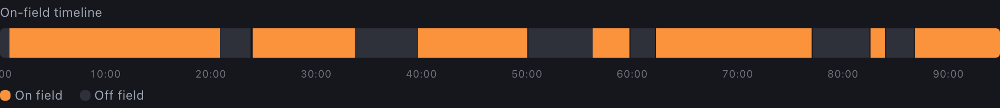
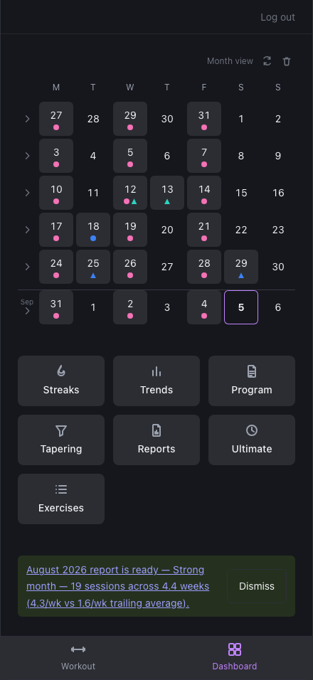
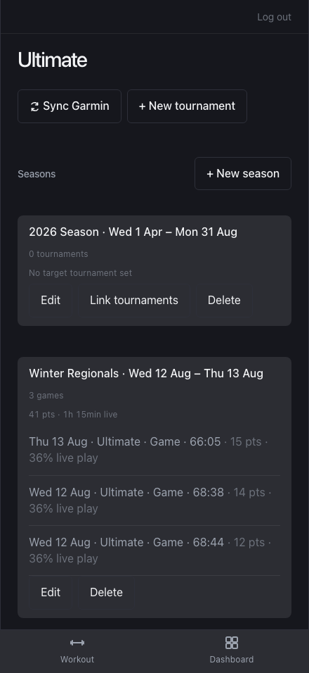
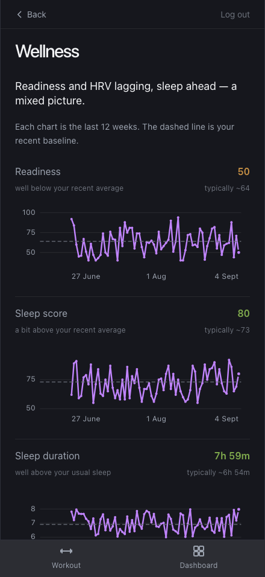
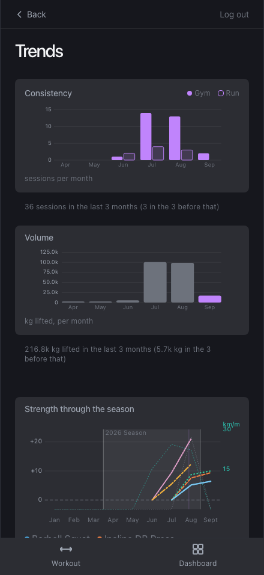

# Callahan

Self-hosted training tracker — gym workouts, running, and GPS-analysed Ultimate Frisbee
games, with wellness data pulled from Garmin Connect. It started as a way around Hevy's
history paywall and grew into the thing that measures my season. Live at
`callahan.ljlab.online`.

A game's GPS track is fit to the field's own geometry to work out when I was on the
field, how many points I played, and how much of the clock was live play — position
rather than speed thresholds, for
[reasons](docs/decisions.md#onoff-field-comes-from-position-geometry-not-speed).



<sub>One game, 95 minutes, orange = on the field. Real GPS, real classifier output.</sub>

| Dashboard | Ultimate | Wellness | Trends |
|---|---|---|---|
|  |  |  |  |

<sub>Seed data, not real training history (`npm run shots` regenerates these).</sub>

## Documentation

- **[docs/decisions.md](docs/decisions.md)** — the design decisions behind the app and the
  reasoning for each: why on/off-field classification uses position geometry rather than
  speed, why a metric that fires every month is measuring the wrong thing, why the test
  suite was mutation-checked before it was trusted, and what the native iOS wrap exists
  for. This is the most interesting file in the repo.
- **[docs/architecture.md](docs/architecture.md)** — how the pieces fit together: the four
  containers, the request path, the backend layers, and the data model.
- **[docs/program-sync.md](docs/program-sync.md)** — how program and template changes get
  applied, and why there's no in-app editor by design.
- **`.ui-craft/brief.md`** — the design brief and the UI constraints learned along the way.

## Stack
- Backend: C# ASP.NET Core Web API (.NET 10), EF Core + SQLite
- Frontend: React (Vite), plain CSS with a token spine (`frontend/src/index.css`)
- Auth: single credential + JWT (deliberately not ASP.NET Identity — single-user app)
- Sync: a Python sidecar + nightly cron pulling activities and wellness from Garmin Connect
- Hosting: Docker Compose on a home NAS, behind a Cloudflare tunnel
- Native: the same build wrapped as an iOS app (Capacitor 8) with a SwiftUI widget extension — see "The native iOS app"

## Features

**Gym.** Workout templates (a 3-day program seeded from a program PDF) with per-exercise
target sets/reps/rest/tempo and a persistent per-slot cue note. The active workout flow is
tick-to-complete sets, warmup/failure/drop set types, rest timers with background alerts,
per-session exercise notes, optional finishers, and a live duration/volume header. Plus a
history list, full per-session detail, a plate calculator, and a recently-deleted view.

**Analysis.** A per-exercise stats page (progression chart, PRs, paginated history);
muscle-group tagging with a weekly Muscle Balance bar chart and front/back heatmap; three
weekly streak definitions with current/best runs and a per-week drill-down; and a Trends
page charting consistency and volume over six months alongside the exercises that moved
most.

**Ultimate Frisbee.** Beyond the on/off-field classification described above, games
group into tournaments and seasons, and a tournament carries a step-taper that the Taper
page computes deterministically (with an optional LLM consult strictly alongside the
numbers, never gating them).

**Wellness and reports.** Nightly Garmin sync fills a daily wellness record — sleep, HRV,
body battery, resting HR — surfaced as per-metric comparisons against a trailing 28-day
baseline. Monthly reports snapshot a period and make a call on it (Strong / Steady / Down),
100% deterministically.

**Dashboard.** A month calendar grid of workouts, runs and games — tap a day for a
bottom-sheet detail — plus a quick-links grid into the pages above.

**Data.** Historical gym data imported from a Hevy CSV export (76 sessions, notes and tempo
backfilled from the program doc; template association backfilled from Apr 28, 2026 onward,
once the program had settled). Session display names use the template's name where one is
associated, otherwise a summary of the exercise categories actually done — most imported
history predates any template.

**iOS.** On the native build: a Live Activity for the open workout on the lock screen and
Dynamic Island with working -15s / +15s / Skip, and a rest beep that plays through the
silent switch, ducks your music rather than stopping it, and fires while backgrounded.

## Running locally (without Docker)

Backend:
```bash
cd backend
dotnet run --urls http://localhost:5080
```

Frontend:
```bash
cd frontend
npm install
npm run dev
```
Frontend expects the backend at `http://localhost:5080` by default (`VITE_API_BASE` env var to override).

## Running locally with Docker

```bash
docker compose up --build
```
- Backend: http://localhost:8080
- Frontend: http://localhost:8081

`docker-compose.yml` (this local-dev file, not `docker-compose.prod.yml`) sets
`ASPNETCORE_ENVIRONMENT=Development` and `Auth__AllowDevLogin=true`, which together
enable `POST /api/auth/dev-login` — see "Verifying UI changes without a password"
below.

## The native iOS app

The same React build also ships as a native iOS app (Capacitor 8, `frontend/ios/`).
It exists for things a PWA cannot do on iOS: a Live Activity rest timer on the lock
screen and Dynamic Island, and a beep that is audible through the hardware silent
switch, ducks your music instead of stopping it, and still fires while the phone is
backgrounded and locked.

**The webview loads the live site**, not a bundled copy of `dist/` — `server.url` in
`frontend/capacitor.config.json` points at `https://callahan.ljlab.online`. So a push
to `main` updates the PWA *and* the native app together, and Xcode is only needed
when the Swift changes. The trade is no offline support, which this app never had
anyway (every screen reads from the API).

### A fresh checkout needs a sync before Xcode will build

`capacitor.config.json`, `config.xml` and `public/` inside `ios/App/App/` are
generated and gitignored, so a clean clone has an Xcode project with no web assets
and fails at link time with `Command Ld failed`. Run this first:

```bash
cd frontend && npm install && npm run build && npx cap sync ios
```

Then open `frontend/ios/App/App.xcodeproj` (SwiftPM — there is no `.xcworkspace`).

### Signing

Both the **App** and **CallahanWidgets** targets need a development team; the build
fails on the widget target if only the app is set. On a free Apple ID the install
expires after 7 days and needs a re-run of ⌘R (wireless once the device is paired).

### Working on it

- Web/UI changes: push to `main`. No rebuild.
- Swift changes: ⌘R.
- `npx cap sync ios` rewrites `packageClassList` from the installed npm plugins, so
  app-target plugins are registered in `MainViewController.capacitorDidLoad()`
  instead — never by hand-editing the generated config.

## Verifying UI changes without a password

`POST /api/auth/dev-login` issues a real JWT for the app's single user with no
password check. The route is only registered at all when **both**
`ASPNETCORE_ENVIRONMENT=Development` and `Auth:AllowDevLogin=true` are set —
deliberately two independent gates, in two different files (`docker-compose.yml` /
`launchSettings.json` locally; neither is present in `backend.prod.env`), so a
single misconfigured env var on the NAS can't accidentally expose it. This lets
tooling (Claude Code's browser preview, etc.) verify authenticated pages without
being handed the real password:
```bash
curl -X POST http://localhost:8080/api/auth/dev-login
# {"token":"..."} — set it as localStorage['callahan_token'] and reload
```

## Deploying

Automatic: `.github/workflows/deploy.yml` deploys to the NAS on every push to `main`
(see `CLAUDE.md` for how it's wired up). To roll back or deploy a specific commit,
run the `Deploy to NAS` workflow manually from the Actions tab with a commit SHA.

EF Core migrations apply automatically on backend startup. Direct DB changes (data backfills, program syncs) follow the procedure in `docs/program-sync.md`.
